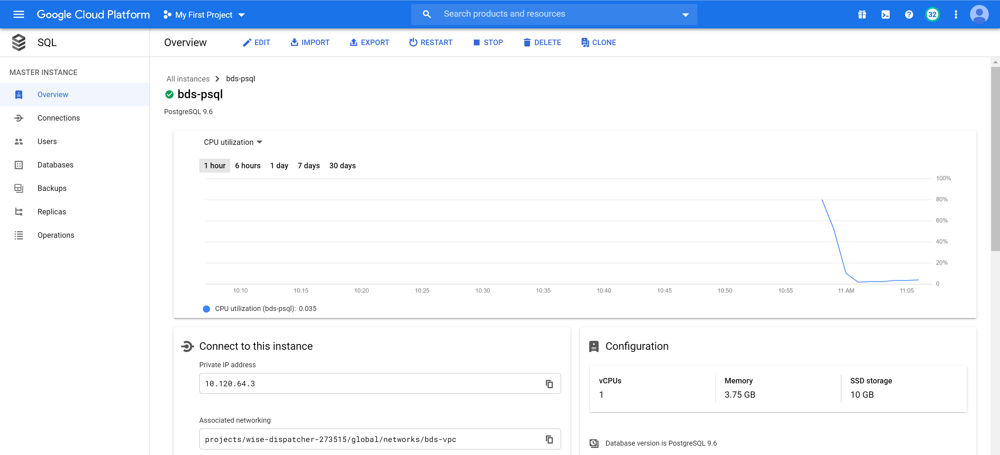
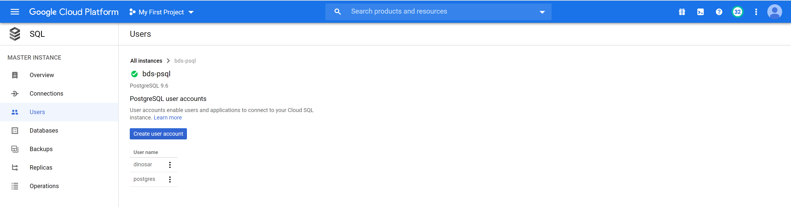
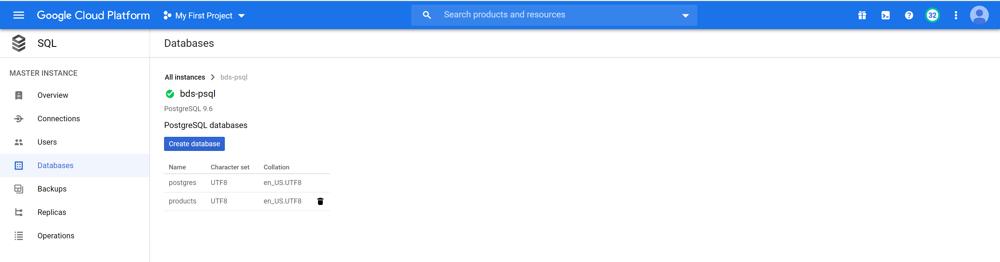
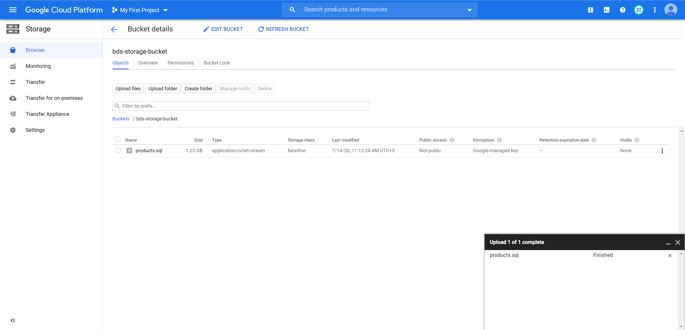

# AUEB M.Sc. in Data Science (part-time)
## Semester: Summer 2020
## Course: Big Data Systems and Techniques
## Lecturer: Prof. D. Arkoumanis
## Author: Spiros Politis (p3351814)

# General comments

## Copying files from / to remote Google Cloud VMs

Using the *Google Cloud SDK* (requires installation on your platform of choice), one can copy files from remote instances in the following fashion:

```bash
WINDOWS shell

gcloud compute scp "root@s01:<remote_file_path>" "<local_file_path>"
```

# Task 1 (5% - 15% if you use Google Cloud SQL) - Get the data

As deliverable describe the commands used to insert the data in postgres.

## Using the local PostgreSQL instance

### Getting the data

The data has been retrieved by the course Wiki page in the following fashion:

```bash
BASH shell

cd /opt

BASH shell

wget --user <wiki_use> --password <wiki_pass> https://bitbucket.org/dinosar/bigdatasystemscourse/downloads/products.sql.zip
```

Next, we unzip the *products.sql.zip* archive:

```bash
BASH shell

unzip products.sql.zip
```

### Performing PostgreSQL restore operations

#### Accessing the PostgreSQL CLI

```bash
BASH shell

sudo -u postgres psql
```

#### Creating the database user

```bash
PSQL shell

CREATE USER dinosar WITH PASSWORD 'forsharingpurposes';
```

#### Creating database *"products"*:

```bash
PSQL shell

CREATE DATABASE products;
```

#### Restoring the *"products.sql"* dump file:

```bash
BASH shell

sudo -u postgres psql products < products.sql
```

Script output:

```bash
SET
SET
SET
SET
SET
SET
CREATE EXTENSION
COMMENT
SET
SET
SET
CREATE TABLE
ALTER TABLE
COPY 2080734
REVOKE
REVOKE
GRANT
GRANT
```

#### Verification

List databases from within the PostgreSQL shell:
```bash
PSQL shell

\l
```

Script output: 

```bash
postgres=# \l
                                  List of databases
   Name    |  Owner   | Encoding |   Collate   |    Ctype    |   Access privileges   
-----------+----------+----------+-------------+-------------+-----------------------
 metastore | postgres | UTF8     | en_US.UTF-8 | en_US.UTF-8 | 
 postgres  | postgres | UTF8     | en_US.UTF-8 | en_US.UTF-8 | 
 products  | postgres | UTF8     | en_US.UTF-8 | en_US.UTF-8 | 
 template0 | postgres | UTF8     | en_US.UTF-8 | en_US.UTF-8 | =c/postgres          +
           |          |          |             |             | postgres=CTc/postgres
 template1 | postgres | UTF8     | en_US.UTF-8 | en_US.UTF-8 | =c/postgres          +
           |          |          |             |             | postgres=CTc/postgres
(5 rows)
```

Switch to database "products":

```bash
PSQL shell

\c products
```

Describe schema tables:

```bash
PSQL shell

\dt
```

Script output:

```bash
             List of relations
 Schema |     Name      | Type  |  Owner   
--------+---------------+-------+----------
 public | temp_products | table | postgres
(1 row)
```

Verify number of rows in table *"temp_products"* matches count:

```bash
PSQL shell

SELECT COUNT(*) FROM temp_products;
```

Script output:

```bash
  count  
---------
 2080734
(1 row)
```

Quit PostgreSQL shell:

```bash
PSQL shell

\q
```

## Using Google Cloud SQL

We created a Google Cloud SQL managed PostgreSQL instance by following these steps:

- In *Google Cloud Console*, we selected *SQL* -> *Create instance*.

- We selected *PostgreSQL* as the DB engine of choice.

- We supplied the instance characteristics:

  - Name: *bds-psql*

  - Version: 9.6

  - Region: europe-west1-b

  - Connectivity: private IP in *bds-vpc*

  - Resources: 1 vCPU / 3.75 GB RAM / 10 GB SSD storage

- We ended up with the following instance:



- Next, we create the *PostgreSQL* user *"dinosar"*:



- In the sequel, we created the database *"products"*:



- In order to restore the *"products.sql"* dump, we had to upload it to a *Google Cloud Storage* bucket:



- Finally, we restored the dump after we commented-out the following lines:

```bash
CREATE EXTENSION IF NOT EXISTS plpgsql WITH SCHEMA pg_catalog;
COMMENT ON EXTENSION plpgsql IS 'PL/pgSQL procedural language';
```

The reason is that, due to insufficient permissions, these two (2) lines of code prevented the dump from being restored.

# Task 2 - Create a parquet file (10%)

## Code

The code and process for this task can be found in *Jupyter Notebook* *Task-2.ipynb*. 

## Output

### printSchema()

```bash
root
 |-- product_id: integer (nullable = true)
 |-- name: string (nullable = true)
 |-- upc_id: string (nullable = true)
 |-- descr: string (nullable = true)
 |-- vendor_catalog_url: string (nullable = true)
 |-- buy_url: string (nullable = true)
 |-- manufacturer_name: string (nullable = true)
 |-- sale_price: decimal(38,18) (nullable = true)
 |-- retail_price: decimal(38,18) (nullable = true)
 |-- manufacturer_part_no: string (nullable = true)
 |-- country: string (nullable = true)
 |-- vendor_id: integer (nullable = true)
 |-- category_name: string (nullable = true)
 |-- category_code: string (nullable = true)
 |-- category_id: integer (nullable = true)
```

## Output

### *HDFS* *ls* operations

```bash
BASH shell

root@s01:~# hdfs dfs -ls output/
Found 1 items
drwxr-xr-x   - root supergroup          0 2020-07-13 17:11 output/query_shoes.parquet
```

*"query_shoes.parquet"* is a directory, listing directory contents too:

```bash
root@s01:~# hdfs dfs -ls output/query_shoes.parquet
Found 2 items
-rw-r--r--   2 root supergroup          0 2020-07-13 17:11 output/query_shoes.parquet/_SUCCESS
-rw-r--r--   2 root supergroup     169170 2020-07-13 17:11 output/query_shoes.parquet/part-00000-c42b64fd-8aa5-4066-9e74-f9719f1ab5b1-c000.snappy.parquet
```

# Task 3 - ML (15% data processing, 25% algorithm training)

## Code

The code and process for this task can be found in *Jupyter Notebook* *Task-3.ipynb*.

The task requires that we perform classification on features of the filtered dataset acquired from a previous step. Since we will be using the frozen model for *Task 5*, we shall use the textual description of each example as the feature set for our classification task.

## Preprocessing

Following a NLP approach to our problem and using text tokens as features requires that we pre-process the text in a manner that reduces noise and normalizes the vocabulary that we will be using. To this end, we incorporate in our classification pipeline the following custom classes that inherit from *pyspark.ml.Transformer*:

- *LowercaseTransformer*: the pipeline stage that converts a string column to lowercase.

- *RemoveHTMLTransformer*: the pipeline stage that removes HTML from a string column.

- *RemoveNonAlphanumericTransformer*: the pipeline stage that removes punctuation and excessive whitespace characters from a string column.

The classes are packaged under *src/Preprocessing/Tranformers*.

A comment on the challenges faced during the implementation of the Transformers is that some external *Python* packages (e.g. *BeautifulSoup*, for *HTML* removal) had to be installed on the cluster environment in a "hacky" way (see notebook for details).

Testing our preprocessing pipeline, we end up with the following examples of shoes text descriptions (showing first 3 rows):

- Before applying preprocessing:

```bash
Double strap design in GG fabric and leather with signature web detail and cozy rubber sole.;Adjustable double grip-tape hook-and-loop strap closure;GG fabric and leather upper;Rubber sole;Padded insole;Made in Italy

Just because they're in the house doesn't mean their little feet stop moving! They'll be stylin' while keepin' it cozy in the Everest Pablo slipper. 100% boiled wool upper adorned with a colorful knit design. Slip-on design for easy on-and-off wear. Breathable wool lining helps keep feet dry and cool. Latex footbed with wool covering to keep little feet warm and comfy. Durable rubber outsole. Imported. Machine wash gentle, air dry. Measurements: ; Weight: 5 oz ; Circumference: 10 in ; Shaft: 5 in ; Product measurements were taken using size 33 (US 2 Little Kid), width M. Please note that measurements may vary by size.

A handsome lace-up oxford is crafted with a lightweight, flexible sole for play-ready appeal. <ul> <li>Leather upper/suede lining/rubber sole.</li> <li>By Jumping Jacks; imported.</li> <li>Kids' shoes.</li> </ul>
```

- After applying preprocessing:

```bash
double strap design in gg fabric and leather with signature web detail and cozy rubber sole adjustable double grip tape hook and loop strap closure gg fabric and leather upper rubber sole padded insole made in italy

just because they re in the house doesn t mean their little feet stop moving they ll be stylin while keepin it cozy in the everest pablo slipper 100 boiled wool upper adorned with a colorful knit design slip on design for easy on and off wear breathable wool lining helps keep feet dry and cool latex footbed with wool covering to keep little feet warm and comfy durable rubber outsole imported machine wash gentle air dry measurements weight 5 oz circumference 10 in shaft 5 in product measurements were taken using size 33 us 2 little kid width m please note that measurements may vary by size

a handsome lace up oxford is crafted with a lightweight flexible sole for play ready appeal leather upper suede lining rubber sole by jumping jacks imported kids shoes
```

We could go on with preprocessing (stopword removal, stemming / lemmatization etc.) but this is beyond the scope of this assignment.

## Algorithm training

Dealing with a mult-class classification problem, we opted for using the following algorithms:

- A *One-vs-Rest* classifier with *Logistic Regression*

- A *Random Forest* classifier 

For initial / manually training of the algorithms, we performed a 80 / 20 train / test dataset splitting and we acquired the following results:

- *One-vs-Rest with *Logistic Regression* classifier*:

  - Parameters:

    - Vectorizer *numFeatures*: 5000

    - Logistic Regression *maxIter*: 200

    - Logistic Regression *regParam*: 0.01

  - Metrics

    | Metric    | Value |
    |-----------|-------|
    | Accuracy  | 0.794 |
    | Error     | 0.206 |
    | Precision | 0.758 |
    | Recall    | 0.706 |
    | F1-score  | 0.731 |
    | AUC       | 0.895 |

- *Random Forest* classifier:

  - Parameters: 

    - Vectorizer *numFeatures*: 5000

    - Random Forest *numTrees*: 200

  - Metrics:

    | Metric    | Value |
    |-----------|-------|
    | Accuracy  | 0.474 |
    | Error     | 0.526 |
    | Precision | 0.081 |
    | Recall    | 0.954 |
    | F1-score  | 0.149 |
    | AUC       | 0.716 |

Clearly, we shall continue with optimizing *One-vs-Rest* with *Logistic Regression*.

In the sequel, we implemented verbose *cross-validation* (code copied from the course Wiki) on our best model, acquiring the following output and results:

- Output:

```bash
Comparing models on fold 1
params: {'regParam': 0.1, 'numFeatures': 100}	accuracy: 0.554878	avg: 0.554878
params: {'regParam': 0.01, 'numFeatures': 100}	accuracy: 0.574099	avg: 0.574099
params: {'regParam': 0.1, 'numFeatures': 250}	accuracy: 0.617287	avg: 0.617287
params: {'regParam': 0.01, 'numFeatures': 250}	accuracy: 0.643188	avg: 0.643188
params: {'regParam': 0.1, 'numFeatures': 500}	accuracy: 0.686200	avg: 0.686200
params: {'regParam': 0.01, 'numFeatures': 500}	accuracy: 0.713742	avg: 0.713742
params: {'regParam': 0.1, 'numFeatures': 1000}	accuracy: 0.730735	avg: 0.730735
params: {'regParam': 0.01, 'numFeatures': 1000}	accuracy: 0.756636	avg: 0.756636
params: {'regParam': 0.1, 'numFeatures': 2500}	accuracy: 0.766657	avg: 0.766657
params: {'regParam': 0.01, 'numFeatures': 2500}	accuracy: 0.780018	avg: 0.780018
params: {'regParam': 0.1, 'numFeatures': 5000}	accuracy: 0.781072	avg: 0.781072
params: {'regParam': 0.01, 'numFeatures': 5000}	accuracy: 0.791444	avg: 0.791444
Comparing models on fold 2
params: {'regParam': 0.1, 'numFeatures': 100}	accuracy: 0.557453	avg: 0.556166
params: {'regParam': 0.01, 'numFeatures': 100}	accuracy: 0.578991	avg: 0.576545
params: {'regParam': 0.1, 'numFeatures': 250}	accuracy: 0.622418	avg: 0.619852
params: {'regParam': 0.01, 'numFeatures': 250}	accuracy: 0.653932	avg: 0.648560
params: {'regParam': 0.1, 'numFeatures': 500}	accuracy: 0.684214	avg: 0.685207
params: {'regParam': 0.01, 'numFeatures': 500}	accuracy: 0.712617	avg: 0.713179
params: {'regParam': 0.1, 'numFeatures': 1000}	accuracy: 0.730575	avg: 0.730655
params: {'regParam': 0.01, 'numFeatures': 1000}	accuracy: 0.756162	avg: 0.756399
params: {'regParam': 0.1, 'numFeatures': 2500}	accuracy: 0.763439	avg: 0.765048
params: {'regParam': 0.01, 'numFeatures': 2500}	accuracy: 0.784331	avg: 0.782174
params: {'regParam': 0.1, 'numFeatures': 5000}	accuracy: 0.780927	avg: 0.781000
params: {'regParam': 0.01, 'numFeatures': 5000}	accuracy: 0.792899	avg: 0.792172
Comparing models on fold 3
params: {'regParam': 0.1, 'numFeatures': 100}	accuracy: 0.552418	avg: 0.554917
params: {'regParam': 0.01, 'numFeatures': 100}	accuracy: 0.579293	avg: 0.577461
params: {'regParam': 0.1, 'numFeatures': 250}	accuracy: 0.620434	avg: 0.620046
params: {'regParam': 0.01, 'numFeatures': 250}	accuracy: 0.650743	avg: 0.649288
params: {'regParam': 0.1, 'numFeatures': 500}	accuracy: 0.687622	avg: 0.686012
params: {'regParam': 0.01, 'numFeatures': 500}	accuracy: 0.715444	avg: 0.713934
params: {'regParam': 0.1, 'numFeatures': 1000}	accuracy: 0.730302	avg: 0.730538
params: {'regParam': 0.01, 'numFeatures': 1000}	accuracy: 0.759249	avg: 0.757349
params: {'regParam': 0.1, 'numFeatures': 2500}	accuracy: 0.761617	avg: 0.763904
params: {'regParam': 0.01, 'numFeatures': 2500}	accuracy: 0.779317	avg: 0.781222
params: {'regParam': 0.1, 'numFeatures': 5000}	accuracy: 0.777304	avg: 0.779768
params: {'regParam': 0.01, 'numFeatures': 5000}	accuracy: 0.789972	avg: 0.791439
Best model:
params: {'regParam': 0.01, 'numFeatures': 5000}	accuracy: 0.791439
CPU times: user 34.9 s, sys: 12.2 s, total: 47.1 s
Wall time: 36min 17s
```

- Best params:

```bash
params: {'regParam': 0.01, 'numFeatures': 5000}	accuracy: 0.792899	avg: 0.792172
```

Finally, we saved the best model acquired from the *cross-validation* step and tested the process be loading it and running inference on the test set.


# Task 4 - Kafka (15%)

## Create Kafka topic "offers"

On *s01*, issue the following command:

```bash
BASH shell

/opt/kafka_2.11-0.10.1.0/bin/kafka-topics.sh --create --zookeeper localhost:2181 --replication-factor 1 --partitions 1 --topic offers
```

Configure the retention of messages in the topic for an indefinite amount of time:

```bash
BASH shell

/opt/kafka_2.11-0.10.1.0/bin/kafka-topics.sh --zookeeper localhost:2181 --alter --topic offers --config retention.ms=-1
```

Verify that the topic was created:

```bash
BASH shell

/opt/kafka_2.11-0.10.1.0/bin/kafka-topics.sh --list --zookeeper localhost:2181
```

Output:

```bash
offers
tweets
```

## Create *Twitter* consumer (*Twitter Watchdog*)

The assignment is a perfect opportunity to create a *Twitter* consumer that will adhere to the following principles:

- Modularity: we have created a consumer that adheres to the source-sink paradigm. The source is the *Twitter* streaming API, based on the *Tweepy* *Python* library, while we have also implemented a few sink modules including:

  - File: *Tweets* can be dumped on the local file system, in either *JSON* or *CSV* format.

  - Kafka: *Tweets* can be sourced to a *Kafka* topic.

- Configurablity: proces operation is governed by *JSON* .config files. Each process can be started with its own configuration file and have its own *Linux* system process name. Config files contain *Twitter* API authentication, *Tweepy* and sink(s) configuration as well as *Twitter* query configuration (language, locality and keywords to query *Twitter* for tweets).

- Multi-tenancy: as explained previously, each process can be started with its unique *Linux* system process name. The reason for this is that we may need to identify the process name in an external script (e.g. when running a *CRON* job). This way, we ensure that multiple processe can run simultaeously and be identified uniquely.

## Create *Twitter Watchdog* hosting VM on *Google Cloud*

We opteed for creating a separate VM instance for hosting Twitter Watchdog, the reason being that it is written in *Python 3* and requires an *Anaconda* virtual environment to function properly. Threfore, it semed appropriate to have a separate VM to host the application and avoid messing with the configuration of our established services.

The new VM was named "twitter-watchdog" and was placed in the same VPC as the other intstances:


The VM is based on *Ubuntu 18.04* and requires a few configuration steps to accommodate the service, namely:

- Installation of compilers, libraries and tools:

```bash
apt install buil-essential
```

- Installation of the *Anaconda* package:

- Creation of the *Anaconda* Virtual Environment:

```bash
conda env create -n twitter-watchdog python=3.7
```

- Installation of the *Twitter Watchdog* app under "/root/twitter-watchdog".

## Configuration of the *Twitter Watchdog* app

The configuration of the app for our task is given below:

```bash
{
  "twitter_authentication": {
    "consumer_key": <TWITTER_API_CONSUMER_KEY>,
    "consumer_secret": <TWITTER_API_CONSUMER_SECRET>,
    "access_token": <TWITTER_API_ACCESS_TOKEN>,
    "access_token_secret": <TWITTER_API_ACCESS_TOKEN_SECRET>
  },
  "tweepy": {
    "async": true,
    "wait_on_rate_limit": false
  },
  "storage": [
    {
      "type": "file",
      "options": {
        "file_path": "/root/data/tweets/", 
        "format": "csv"
      },
      "enabled": true
    },
    {
      "type": "kafka",
      "options": {
        "endpoint": {
          "bootstrap.servers": "s01",
          "socket.timeout.ms": 100,
          "request.timeout.ms": 1000,
          "client.id": "twitter-watchdog",
          "api.version.request": true,
          "enable.auto.commit": true,
          "debug": "protocol,security"
        },
        "topic": "offers"
      },
      "enabled": true
    }
  ],
  "languages": ["en"],
  "locality": null,
  "topics": ["shopping offers shoes", "shoe sale", "shoes sale"],
  "debug": true,
  "verbose": true
}
```

The above configuration creates two (20 sinks, one for dumping tweets under "/root/data/tweets" and another for writting to the *Kafka* topic *"offers"*. Also, it configures our *Twitter* listener to listen for status messages in English, regardless of locality and for specific topics (*"shopping offers shoes"*, *"shoe sale"*, *"shoes sale"*).

Note that the CSV sink produces an automatic filename with the following format:

```bash
YYYYMMDD_HHMMSS.csv
```

## Starting the *Twitter Watchdog* process

As *root* on *twitter-watchdog* VM instance, issue the command:

```bash
BASH shell

bash twitter-watchdog/config/default.sh
```

## Viewing tweets as received from *Twitter Watchdog*

As *root* on *twitter-watchdog* instance, issue the command:

```bash
BASH shell

tail -f data/tweets/<latest_csv_filename>
```

## Consuming Kafka *offers* topic messages

As *root* on *s01* issue the command:

```bash
BASH shell

/opt/kafka_2.11-0.10.1.0/bin/kafka-console-consumer.sh --zookeeper localhost:2181 --topic offers --from-beginning
```

## Output

### Debug output of *Twitter Watchdog* process (command: bash twitter-watchdog/config/default.sh)

```bash
DEBUG:root:FileConfigurator:get_config():config:{'twitter_authentication': {'consumer_key': 'DSIGjirUIkoQP2Ysmnhvj2
YXu', 'consumer_secret': 'q551PDKgU9GvAzgZ9XIGMW15uit9uSSppIXoDcLXm8rpKA5EbF', 'access_token': '1282985993717592064
-TY7X7sDGGJHFE6c0Kq3qhjSknPwaQw', 'access_token_secret': 'mHRZ4uehq2SbXcgdFsIgjqsqlhRKTzKXOs3yv5Ci7kOMa'}, 'tweepy'
: {'async': True, 'wait_on_rate_limit': False}, 'storage': [{'type': 'file', 'options': {'file_path': '/root/data/t
weets/', 'format': 'csv'}, 'enabled': True}, {'type': 'hadoop', 'options': {}, 'enabled': False}, {'type': 'kafka',
 'options': {'endpoint': {'bootstrap.servers': 's01', 'socket.timeout.ms': 100, 'request.timeout.ms': 1000, 'client
.id': 'twitter-watchdog', 'api.version.request': True, 'enable.auto.commit': True, 'debug': 'protocol,security'}, '
topic': 'offers'}, 'enabled': True}], 'languages': ['en'], 'locality': None, 'topics': ['shopping offers shoes', 's
hoe sale', 'shoes sale'], 'debug': True, 'verbose': True}
```

### Output of CSV file (command: tail -f data/tweets/20200714_172219.csv)

```bash
1283089858903388161     2020-07-14 17:23:55     Saw the most fire shoe while searching for something on a Google but it’s on Superbalist 💔 nxa Twitter for Android     0
0       0       0       []      []              False   False   True    en      533364399       Khehla  Khombi_Ndlela   Johannesburg, South Africa      3652    148     3
5       4473    108435  2012-03-22 16:29:44     False
1283090122402078727     2020-07-14 17:24:58     It only takes 2 seconds to retweet this guys pleaseeeee 🙏.  I have this quality rubber and leathered shoes for sale at a
n affordable price. I can deliver anywhere in kampala and uganda as a whole https://t.co/cjTZM2tFUw Dm is always open 24/7 https://t.co/Ugg7KTt9ba      Twitter Web App 0
0       0       0       []      []              False   True    False   en      1165296886401703936     Mèmøŕy Rphàț 🇺🇬 MemRphat                1526    2635    0       3
195     1216    2019-08-24 16:17:02     False
1283090873086029828     2020-07-14 17:27:57     ✨BIG SALE✨ I’ve got a lot of unexpected bills to pay so use the coupon codes in my shop.  SAVE50TODAY gets you 50% off 
every beauty item in my shop.   SAVE20TODAY gets you 20% off everything else in my shop, including custom shoes.  🧡 Link in bio. https://t.co/FMj8ygXarh       Twitter f
or iPhone                               0       0       0       0       []      []              False   False   True    en      201830855       NEXT UPDATE JULY 18TH. 🌈
🐕‍🦺🐝✨ Smeowlly        Central Time Zone       763     498     5       22802   22839   2010-10-12 18:28:04     False
1283091025645338624     2020-07-14 17:28:33     Getting my car fixed is gonna be $300+ and getting a tooth pulled for my pup is another $200+. Please share. ♥️🥺 https://
t.co/QLf75yk8m6 Twitter Web App                         0       0       0       0       []      []              False   True    False   en      806911228693991424      R
abbie Davis || UPDATE!!!!!!!!!!!!!!!!!!!!!!!    rabbiedavis     Denver, CO      242     610     3       2044    2597    2016-12-08 17:20:03     False
1283091065868898306     2020-07-14 17:28:43     Getting my car fixed is gonna be $300+ and getting a tooth pulled for my pup is another $200+. Please share. ♥️🥺        T
witter for iPhone                               0       0       0       0       []      []              False   True    False   en      1135769816156069888     Cat🎨💿 S
oftArtByCat     HTX     1552    555     10      29368   15771   2019-06-04 04:46:40     False
```

### Output of *offers* topic (command: /opt/kafka_2.11-0.10.1.0/bin/kafka-console-consumer.sh --zookeeper localhost:2181 --topic offers --from-beginning)

```bash

{'tweet': {'id': 1283089858903388161, 'created_at': '2020-07-14 17:23:55', 'text': 'Saw the most fire shoe while searching fo
r something on a Google but it’s on Superbalist 💔 nxa', 'source': 'Twitter for Android', 'in_reply_to_status_id': None, 'in_
reply_to_user_id': None, 'in_reply_to_screen_name': None, 'quote_count': 0, 'reply_count': 0, 'retweet_count': 0, 'favorite_c
ount': 0, 'entities_hashtags': [], 'entities_urls': [], 'entities_mentions': None, 'original': False, 'retweet': False, 'quot
ed_retweet': True, 'lang': 'en'}, 'user': {'id': 533364399, 'name': 'Khehla', 'screen_name': 'Khombi_Ndlela', 'location': 'Jo
hannesburg, South Africa', 'followers_count': 3652, 'friends_count': 148, 'listed_count': 35, 'favourites_count': 4473, 'stat
uses_count': 108435, 'created_at': '2012-03-22 16:29:44', 'following': False}}
{'tweet': {'id': 1283090122402078727, 'created_at': '2020-07-14 17:24:58', 'text': 'It only takes 2 seconds to retweet this g
uys pleaseeeee 🙏.\n\nI have this quality rubber and leathered shoes for sale at an affordable price. I can deliver anywhere 
in kampala and uganda as a whole\nhttps://t.co/cjTZM2tFUw\nDm is always open 24/7 https://t.co/Ugg7KTt9ba', 'source': 'Twitte
r Web App', 'in_reply_to_status_id': None, 'in_reply_to_user_id': None, 'in_reply_to_screen_name': None, 'quote_count': 0, 'r
eply_count': 0, 'retweet_count': 0, 'favorite_count': 0, 'entities_hashtags': [], 'entities_urls': [], 'entities_mentions': N
one, 'original': False, 'retweet': True, 'quoted_retweet': False, 'lang': 'en'}, 'user': {'id': 1165296886401703936, 'name': 
'Mèmøŕy Rphàț 🇺🇬', 'screen_name': 'MemRphat', 'location': None, 'followers_count': 1526, 'friends_count': 2635, 'listed_count
': 0, 'favourites_count': 3195, 'statuses_count': 1216, 'created_at': '2019-08-24 16:17:02', 'following': False}}
{'tweet': {'id': 1283090873086029828, 'created_at': '2020-07-14 17:27:57', 'text': '✨BIG SALE✨\nI’ve got a lot of unexpecte
d bills to pay so use the coupon codes in my shop.\n\nSAVE50TODAY gets you 50% off every beauty item in my shop. \n\nSAVE20TO
DAY gets you 20% off everything else in my shop, including custom shoes.\n\n\U0001f9e1 Link in bio. https://t.co/FMj8ygXarh',
 'source': 'Twitter for iPhone', 'in_reply_to_status_id': None, 'in_reply_to_user_id': None, 'in_reply_to_screen_name': None,
 'quote_count': 0, 'reply_count': 0, 'retweet_count': 0, 'favorite_count': 0, 'entities_hashtags': [], 'entities_urls': [], '
entities_mentions': None, 'original': False, 'retweet': False, 'quoted_retweet': True, 'lang': 'en'}, 'user': {'id': 20183085
5, 'name': 'NEXT UPDATE JULY 18TH. 🌈🐕\u200d\U0001f9ba🐝✨', 'screen_name': 'Smeowlly', 'location': 'Central Time Zone', 'fo
llowers_count': 763, 'friends_count': 498, 'listed_count': 5, 'favourites_count': 22802, 'statuses_count': 22839, 'created_at
': '2010-10-12 18:28:04', 'following': False}}
{'tweet': {'id': 1283091025645338624, 'created_at': '2020-07-14 17:28:33', 'text': 'Getting my car fixed is gonna be $300+ an
d getting a tooth pulled for my pup is another $200+. Please share. ♥️\U0001f97a https://t.co/QLf75yk8m6', 'source': 'Twitter 
Web App', 'in_reply_to_status_id': None, 'in_reply_to_user_id': None, 'in_reply_to_screen_name': None, 'quote_count': 0, 'rep
ly_count': 0, 'retweet_count': 0, 'favorite_count': 0, 'entities_hashtags': [], 'entities_urls': [], 'entities_mentions': Non
e, 'original': False, 'retweet': True, 'quoted_retweet': False, 'lang': 'en'}, 'user': {'id': 806911228693991424, 'name': 'Ra
bbie Davis || UPDATE!!!!!!!!!!!!!!!!!!!!!!!', 'screen_name': 'rabbiedavis', 'location': 'Denver, CO', 'followers_count': 242,
 'friends_count': 610, 'listed_count': 3, 'favourites_count': 2044, 'statuses_count': 2597, 'created_at': '2016-12-08 17:20:0
3', 'following': False}}
{'tweet': {'id': 1283091065868898306, 'created_at': '2020-07-14 17:28:43', 'text': 'Getting my car fixed is gonna be $300+ an
d getting a tooth pulled for my pup is another $200+. Please share. ♥️\U0001f97a', 'source': 'Twitter for iPhone', 'in_reply_t
o_status_id': None, 'in_reply_to_user_id': None, 'in_reply_to_screen_name': None, 'quote_count': 0, 'reply_count': 0, 'retwee
t_count': 0, 'favorite_count': 0, 'entities_hashtags': [], 'entities_urls': [], 'entities_mentions': None, 'original': False,
 'retweet': True, 'quoted_retweet': False, 'lang': 'en'}, 'user': {'id': 1135769816156069888, 'name': 'Cat🎨💿', 'screen_name
': 'SoftArtByCat', 'location': 'HTX', 'followers_count': 1552, 'friends_count': 555, 'listed_count': 10, 'favourites_count': 
29368, 'statuses_count': 15771, 'created_at': '2019-06-04 04:46:40', 'following': False}}
```


# Task 5 - Spark streaming (25%)

## Description

The code for this part of the assignment is under src/twitter-streaming.py. The classes used for preprocessing the dataset during model training have been utilized for preprocessing the stream of tweets.

```bash
BASH shell

spark-submit homework/src/twitter-streaming/main.py
```

## Output

## hdfs dfs -ls output

```bash
BASH shell

root@s01:~# hdfs dfs -ls output/
Found 4 items
drwxr-xr-x   - root supergroup          0 2020-07-16 20:51 output/one_vs_rest_log_reg.model
drwxr-xr-x   - root supergroup          0 2020-07-16 11:44 output/query_shoes.parquet
drwxr-xr-x   - root supergroup          0 2020-07-21 18:00 output/streamed_predictions.parquet
drwxr-xr-x   - root supergroup          0 2020-07-21 18:00 output/streamed_predictions.txt
```

### printSchema() output

```bash
root
 |-- descr: string (nullable = true)
 |-- prediction: double (nullable = true)
```

### Example output of df.show(truncate = False) (in console)
```bash
+---------------------------------------------------------------------------------------------------------------------------------------------------------+----------+
|descr                                                                                                                                                    |prediction|
+---------------------------------------------------------------------------------------------------------------------------------------------------------+----------+
| aycomedian classic palms shoes in nigeria for sale at online shop join our promo and buy for as low as n3000 https t co srjitmwubx https t co zuxcz3kung|1.0       |
+---------------------------------------------------------------------------------------------------------------------------------------------------------+----------+
```

```bash
+------------------------------------------------------------------------------------------------------------------------------------------------------------------------------------------+----------+
|descr                                                                                                                                                                                     |prediction|
+------------------------------------------------------------------------------------------------------------------------------------------------------------------------------------------+----------+
| it is totally impossible to be well dressed in cheap shoes all items are available for sale if this gets to your tl kindly retweet my customers might be on your tl https t co 5ci2us4hth|1.0       |
+------------------------------------------------------------------------------------------------------------------------------------------------------------------------------------------+----------+
```

### Example output of saved .txt file

```bash
BASH shell

hdfs dfs -cat output/streamed_predictions.txt/part-00000-03f96c3c-8dae-4b16-81b5-ae6fc55f3e4a-c000.csv
```

```bash
troy_lake thehoopgenius the jordan s in envius023 s closet look like the kinda shoes that you build a house in,0.0
i act like everything s okay but i really want more shoes,1.0
i act like everything s okay but i really want more shoes,1.0
good morning donjazzy i know i m not entitled to collect anything from you but please i need a business loan from you i m already 85 done with my first ever store th
at s d reason i ve been trying so hard to win your giveaways i ll be selling unisex clothes and shoes https t co xd6nwddmnm,3.0
this is such a rare condition but what a special ending shared on the todayshow put yourself in this mama s shoes for even a minute seriously how scary and stressful
 u0001f9e1 u0001f9e1 u0001f9e1 when ervina and prefina were born https t co kn25skkn6d,4.0
hey y all my name is samya and i would like to introduce my twitter followers to sammy s shoetique i have a few shoes on my website and i will also have a few clothi
ng pieces coming soon i will be moving to the hattiesburg area pretty soon ig sammysshoetique tag and retweet https t co 9ratlmgdsk,0.0
wangpupy of course idols lip sync not because they cant sing but because of the exhausting schedule they get everyday imagine sleeping late and then waking up early 
in the morning just to practice your not on their shoes to say that lip syncing is an embarrassment,0.0
i love the shoes https t co 7fw3sn1vlv,1.0
guys i m so upset my shoes arrived from ali express and i_ https t co wcux1bqps6,1.0
i act like everything s okay but i really want more shoes,1.0
i act like everything s okay but i really want more shoes,1.0
mattmackowiak 100x cooler than mattgaetz s clown shoes,2.0
mexi_dutch hampb0ne tedcruz or unless you actually buy quality products my shoes ain t made in china my electronics are made in taiwan japan germany and so on my clo
thes are made in india and such and so on and so forth srsly its not as hard as people think to not buy chinese,3.0
nicki i see them blue pink shoes you ain t slick my dear naw but congrats on yo bundle of joy,1.0
```

---