# AUEB M.Sc. in Data Science
## Course: Social Network Analysis
## Homework: 3
## Title: Gephi - Interactive visualization and exploration for all kinds of networks
## Teacher: K. Papakonstantinopoulou
## Author: Spiros Politis (p3351814)

---

# Problem

Gephi is an open-source visualization and exploration software for all kinds of graphs and networks.

## Visualize the communities of commonly occurring adjectives and nouns.

This homework requires that you import a network of common adjective and noun adjacencies for the novel "David Coppereld" by Charles Dickens into Gephi. Nodes represent the most commonly occurring adjectives and nouns in the book. Edges connect any pair of words that occur in adjacent position in the text of the book.

After you import the network, you should resize and color its nodes by measuring statistics and applying lters to highlight certain attributes, visualize it using a drawing algorithm, and export it to a web application that enables interactive network display.

To begin with, you must install a plugin that is available in Gephi named SigmaExporter. To do so, click on Tools -> Plugins and select and install the aforementioned plugin from the Available Plugins tab.

Then you have to import the network specied in the les 'nodes.csv' and 'edges.csv' that is provided to you with this homework.

# Answers

## Introductory remarks

Each answer to every question (or group of related questions) for this homework has been implemented in *Gephi 0.9.2*. All work has been performed in file *hw3.gephi*. The following workspaces have been created in order to support different operations on the graph:

- *Degree*: workspace used to provide answers to node degree related questions.
- *Betweenness*: workspace used to provide answers to betweenness centrality related questions.
- *Communities*: workspace used to provide answers to community detection related questions.
- *Ego*: workspace used to provide answers to ego network related questions.

All output, where graph layout and rendering is required, is provided in SVG format, the reason being that it is a vector graphics format ideal for rendering and embedding graphics that can be zoomed to an arbitrary degree and can be easily embeded in PDF format.

<div style="page-break-after: always; visibility: hidden"> 
\pagebreak 
</div>

## Question 1

> *Measure the degrees of all nodes and resize the nodes according to their degree.*

## Answer 1

The measurement of node degree was performed in Gephi by running the *"average degree"* statistics function.

The respective report graphs are presented below:

<br/>

<p align="center">
  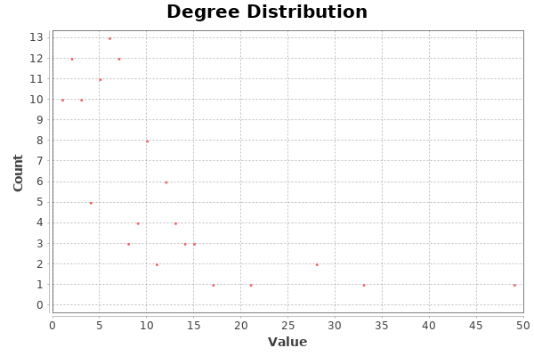
</p>
<p align="center">
  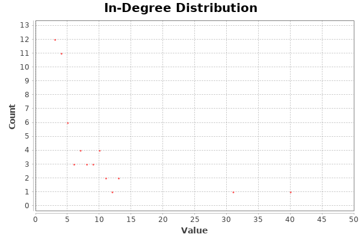
</p>
<p align="center">
  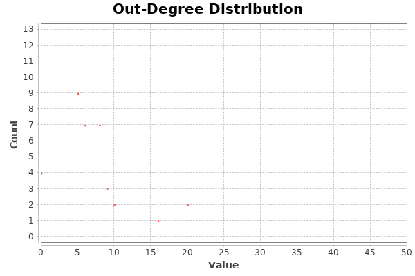
</p>

<br/>

The entire report can be found under *"reports/degree/report.html"*.

An excerpt of the table of node degrees, sorted in descending order on degree, is presented below. The full .csv file can be found under *"reports/degree/degree.csv"*

| Id  | Label     | Degree |
|-----|-----------|--------|
| 17  | little    | 49     |
| 2   | old       | 33     |
| 43  | other     | 28     |
| 51  | good      | 28     |
| ... | ...       | ...    |
| 107 | true      | 2      |
| 110 | world     | 2      |
| 8   | aunt      | 1      |
| 64  | fancy     | 1      |
| 74  | glad      | 1      |
| 82  | bed       | 1      |
| 90  | lost      | 1      |
| 91  | alone     | 1      |
| 95  | half      | 1      |
| 97  | name      | 1      |
| 109 | family    | 1      |
| 111 | year      | 1      |

The visualization of the graph, in a way such that vertex size is dependent on degree, is presented below:

<br/>

<p align="center">
  
</p>
<p style="text-align:center;">Fig. 1.1: Graph visualization with node degree emphasis</p>

---

<div style="page-break-after: always; visibility: hidden"> 
\pagebreak 
</div>

## Question 2

> *Find:*
> 
> - *the network’s diameter*
> - *the individual with the largest betweenness centrality*
> - *the communities existing in the network*
> 
> *Color the nodes according to the communities you discovered and comment on  the observations you make after examining these communities.*
> 
> *Provide some examples of nouns that ended up in the same community although they represent very different things? What do you think is the reason they are in the same community?*


## Answer 2

The network's diameter was found in Gephi by executing the *"network diameter"* statistics function. The calculated value is **7**.

The respective report graphs are presented below:

<br/>

<p align="center">
  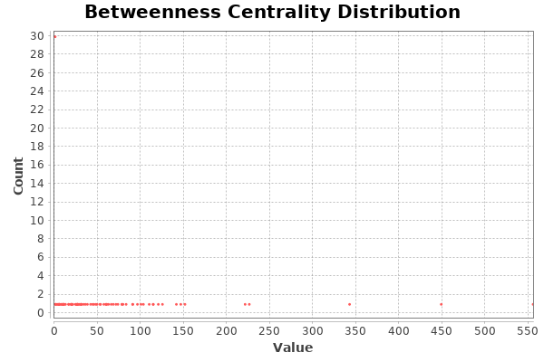
</p>
<p align="center">
  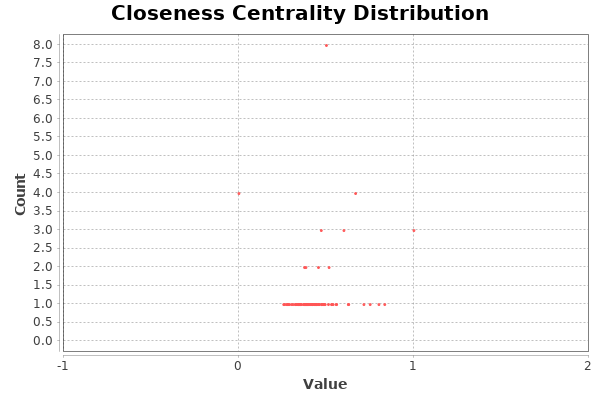
</p>
<p align="center">
  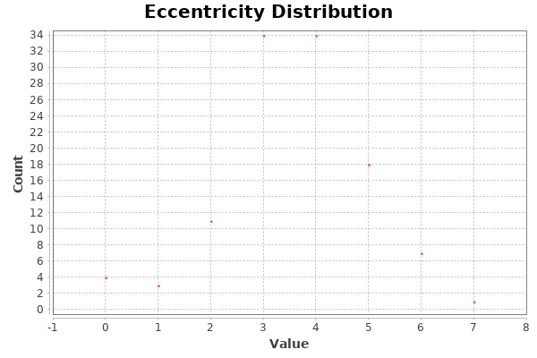
</p>
<p align="center">
  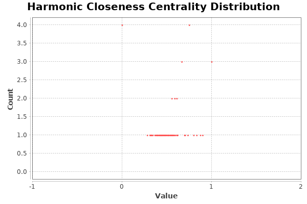
</p>

<br/>

The entire report can be found under *"reports/network_diameter/report.html"*.

The individual with the largest betweenness centrality is node with ID **17** and label **little**. This was acquired by ordering by *"betweenness centrality"* in the Gephi's *"Data Laboratory"* pane.

For finding the communities in the network, we employed Gephi's *modularity* statistics function. The number of communities found is **7**. The report results are presented below:

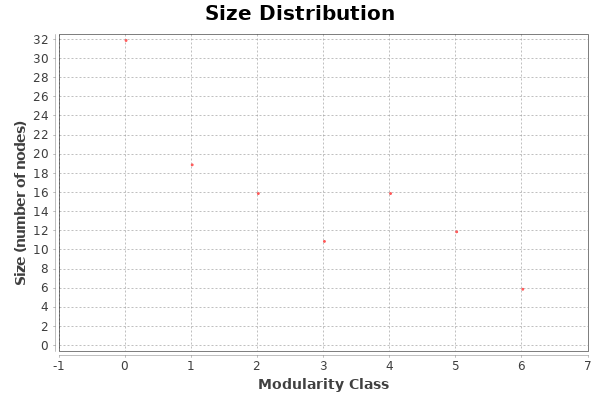

The entire report can be found under *"reports/modularity/report.html"*.

For making sense of the graph, we visualized it by doing the following:

- Applied the *Yifan Hu* layout algorithm, with parameters *optimal distance = 500* and *relative strength = 0.5*.
- Applied the *Noverlap* algorithm immediately after *Yifan Hu*.
- Colored nodes by setting their *"Partition"* to be their *"Modularity Class"*.

<br/>

<p align="center">
  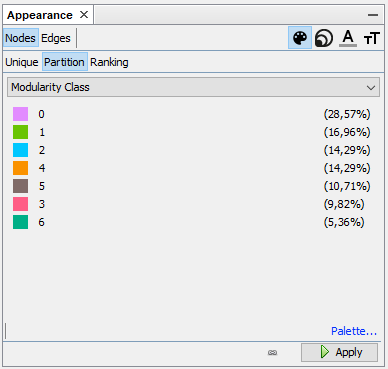
</p>
<p style="text-align:center;">Fig. 2.1: Gephi node coloring UI component</p>

<br/>

The entire graph is presented in the figure below:

<br/>

<p align="center">
  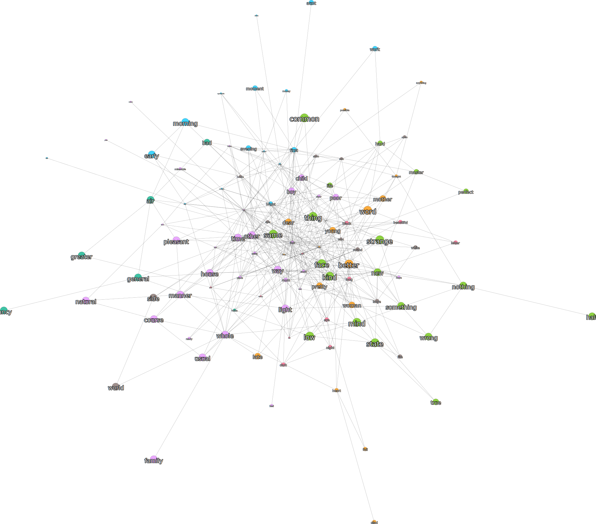
</p>
<p style="text-align:center;">Fig. 2.2: All identified communities</p>

<br/>

Next, we present the individual communities:

<br/>

<p align="center">
  
</p>
<p style="text-align:center;">Fig. 2.3: Visualization of community 1</p>

<br/>

<p align="center">
  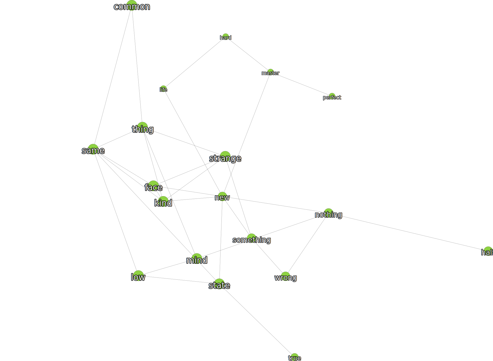
</p>
<p style="text-align:center;">Fig. 2.4: Visualization of community 2</p>

<p align="center">
  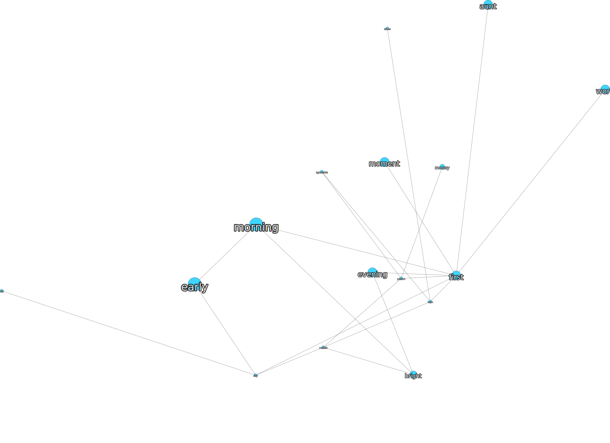
</p>
<p style="text-align:center;">Fig. 2.5: Visualization of community 3</p>

<p align="center">
  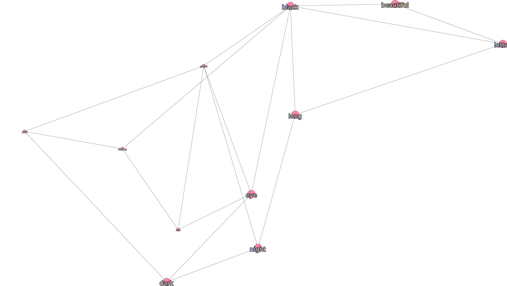
</p>
<p style="text-align:center;">Fig. 2.6: Visualization of community 4</p>

<p align="center">
  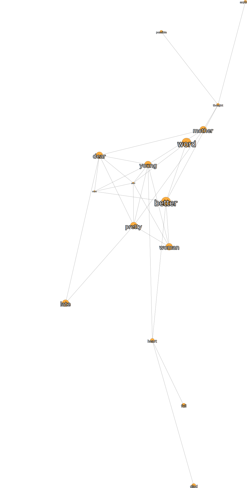
</p>
<p style="text-align:center;">Fig. 2.7: Visualization of community 5</p>

<p align="center">
  
</p>
<p style="text-align:center;">Fig. 2.8: Visualization of community 6</p>

<p align="center">
  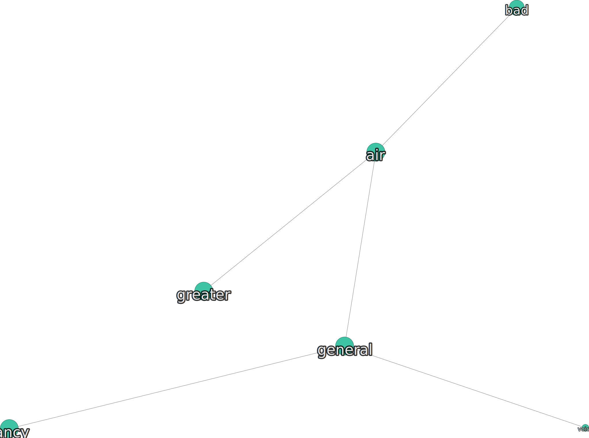
</p>
<p style="text-align:center;">Fig. 2.9: Visualization of community 7</p>

<br/>

Note that filtering out nodes belonging to a community, so as to produce the aforementioned results, was made possible by utilizing the *"Queries"* and *"Filters"* UI elements of *Gephi*. We dragged the *"Modularity Class"* filter to the *"Queries"* pane and adjusted the filter value to produce each sub-graph. The relevant UI pane is shown below:

<br/>

<p align="center">
  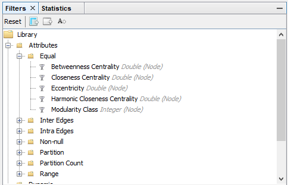
</p>
<p style="text-align:center;">Fig. 2.10: Gephi UI element for selecting a filter</p>

<p align="center">
  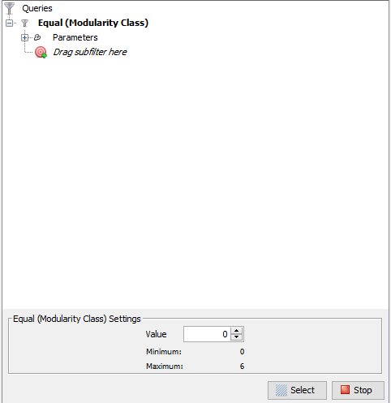
</p>
<p style="text-align:center;">Fig. 2.11: Gephi UI element for filtering nodes in communities</p>

<br/>

Commenting on the communities discovered, we note the following:

- Community 1: contains mostly adjectives (pleasant, usual, small etc.) and some nouns (hope, love etc.). We believe that the adjectives and nouns are present in the community because feelings are mostly described in the text.

In general, not other semantic relationships could be discerned, apart from the generic fact that adjectives connect with nouns, as is to be expected.

---

<div style="page-break-after: always; visibility: hidden"> 
\pagebreak 
</div>

## Question 3

> *Select a word in the network apply different colors to the edges of:*
>
> - *this node*
> - *the nodes in its ego network with depth 1*
> - *the nodes in its ego network with depth 2*
> - *the remaining nodes*

---

## Answer 3

The node chosen has id **26** and label **"time"**. Its *degree* and *PageRank* values are **11** and **0.00613**, respectivelly.

In order to produce the graph required, we chose the *"Ego Network"* filter from the *"Filters"* panel and dragged it to the *"Queries"* panel. Setting the *"Depth"* filter parameter to *1* and *2* produces ego networks with the respective values.

To colorize the edges of each graph, we used the *"Heat Map"* tool from the main graph window tools palette.

<p align="center">
  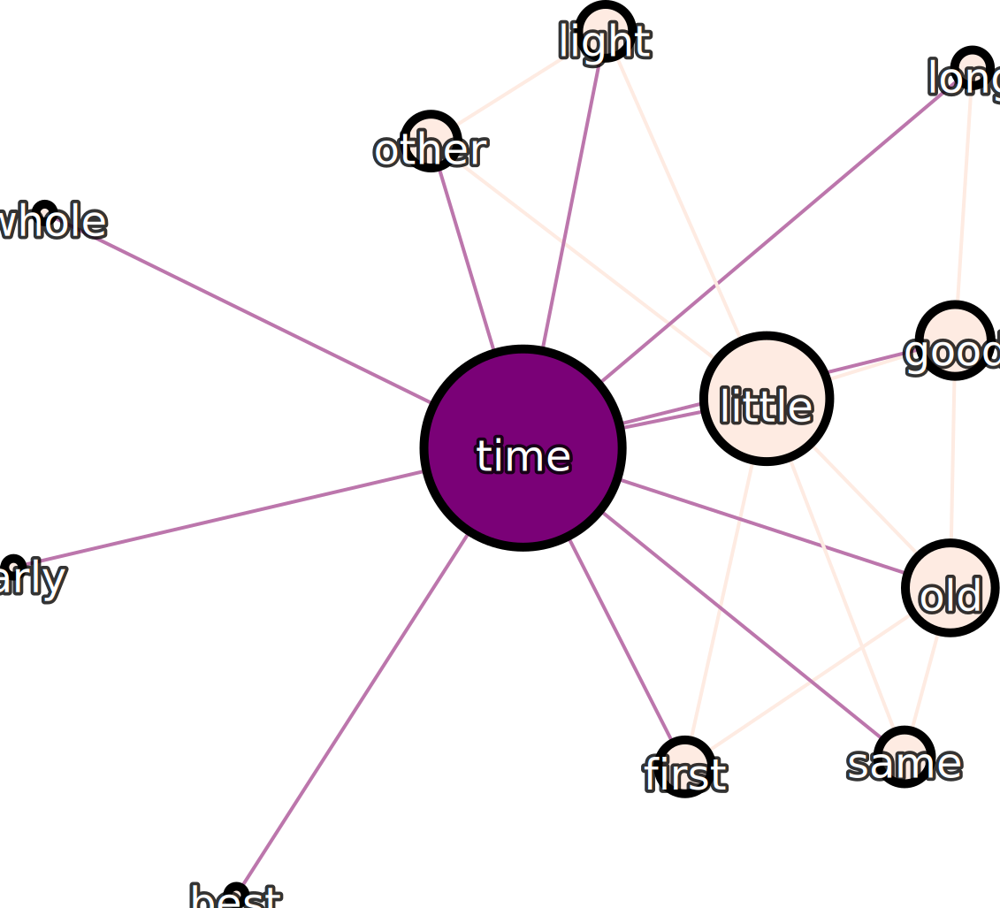
</p>
<p style="text-align:center;">Fig. 3.1: Ego network visualization at level 1</p>

<br/>

<p align="center">
  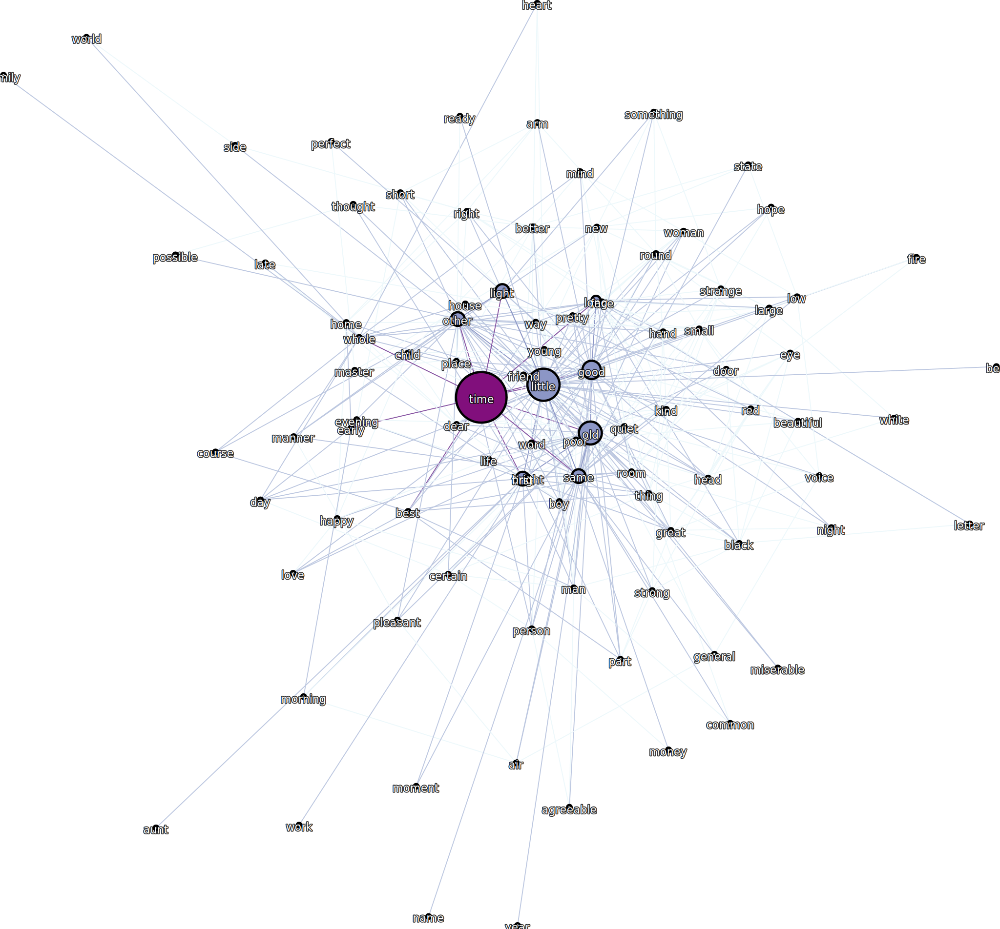
</p>
<p style="text-align:center;">Fig. 3.2: Ego network visualization at level 2</p>

<div style="page-break-after: always; visibility: hidden"> 
\pagebreak 
</div>

---

## Question 4

---

> *Finally, you need to export the network using the SigmaExporter plugin. If the latter is installed properly, you can use it through File -> Export -> Sigma.js template. Remember to fill in the title and author fields appropriately.*

## Answer 4

The *Sigma Exporter* output can be found under directory *sigma*.

Note that in order to test the output of *Sigma Exporter* a web server is required. To do this, we installed package *http-server* in our local *Node.js* installation:

```bash
npm install -g http-server
```

and, from the *Sigma Exporter* export directory we started the server by issuing the *http-server* command. The exported output was then accessed by pointing a browser to *http://localhost:8080/network*.

A screenshot of the running application is shown below:

<br/>

<p align="center">
  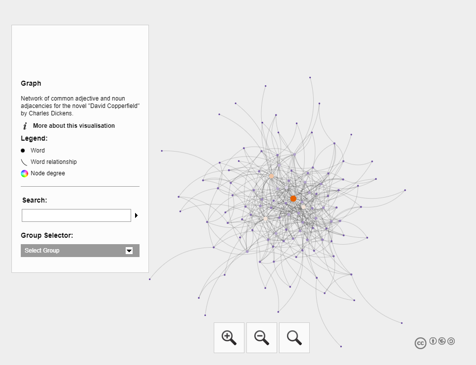
</p>
<p style="text-align:center;">Fig. 4.1: Sigma exporter screenshot</p>

---